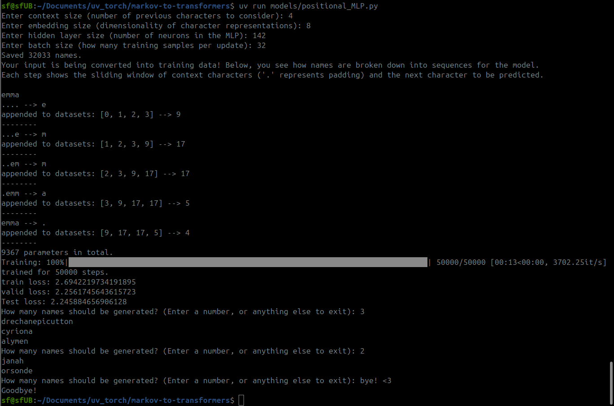

# Markov to Transformers: Character-Level Name Generation

This repo explores character-level name generation using different modeling techniques—from a straightforward trigram-based Markov Model to a Multilayer Perceptron (MLP).

## Models

### 1. Trigram-based Markov Model

Generates new names using trigram probabilities from existing data, applying Laplace smoothing to handle unseen sequences.


- **Easy to understand** and quick to generate names.
- Good baseline for probabilistic models.

### 2. Multilayer Perceptron (MLP)

A simple neural network trained to predict the next character given two preceding characters.


- Tries to be fancier than Markov, but kinda just fumbles around. Super simple implementation (for now!)

### 3. Positional MLP Model

An improved version of the MLP model that incorporates both positional embeddings and dense character embeddings.

Each character is mapped to an n-dimensional embedding rather than a one-hot vector.

These embeddings are learned during training, allowing the model to capture relationships between characters.

Instead of zero-padding or treating all characters uniformly, the model assigns unique positional encodings to the start tokens.

This approach is inspired by [A Neural Probabilistic Language Model (Bengio et al., 2003)](https://www.jmlr.org/papers/volume3/bengio03a/bengio03a.pdf), with the additional inclusion of positional embeddings to enhance sequential awareness.



## How to Run

### Markov Model
```bash
python models/markov-model.py
```

### Basic MLP Model
```bash
python models/MLP.py
```

### Positional MLP Model
```bash
python models/positional_MLP.py
```

Provide the path to your dataset (`names.txt`) when prompted. Models are interactive—enter a starting character and see generated names!

## Dependencies
- Python 3.x
- PyTorch

Install with:

```bash
pip install torch
```

## Dataset

Place your `names.txt` file inside the `data/` directory. Each line should contain one name.

## Notebooks
Check the notebooks for a detailed, step-by-step breakdown of each model, from preprocessing to training.

---
