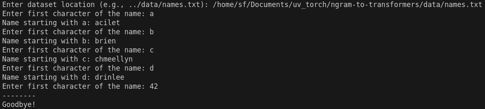
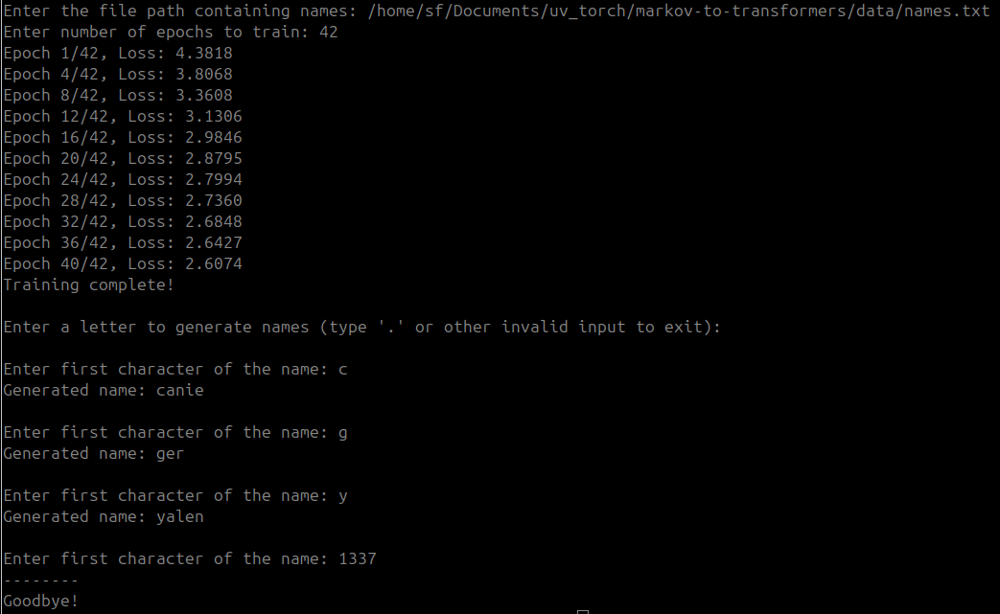

# Markov to Transformers: Character-Level Name Generation

This repo explores character-level name generation using different modeling techniques—from a straightforward trigram-based Markov Model to a simple Multilayer Perceptron (MLP).

## Structure

```
atacolak-markov-to-transformers/
├── data/
├── models/
│   ├── markov-model.py
│   └── MLP.py
├── notebooks/
│   ├── Multilayer Perceptron for Next Character Prediction.ipynb
│   └── Trigram-based Markov Model for Name Generation.ipynb
└── results/
    ├── markov_model.png
    └── mlp_model.png
```

## Models

### 1. Trigram-based Markov Model

Generates new names using trigram probabilities from existing data, applying Laplace smoothing to handle unseen sequences.



- **Easy to understand** and quick to generate names.
- Good baseline for probabilistic models.

### 2. Multilayer Perceptron (MLP)

A simple neural network trained to predict the next character given two preceding characters.



- Tries to be fancier than Markov, but kinda just fumbles around. Super simple implementation (for now!)

## How to Run

### Markov Model
```bash
python models/markov-model.py
```

### MLP Model
```bash
python models/MLP.py
```

Provide the path to your dataset (`names.txt`) when prompted. Models are interactive—enter a starting character and see generated names!

## Dependencies
- Python 3.x
- PyTorch

Install with:

```bash
pip install torch
```

## Dataset

Place your `names.txt` file inside the `data/` directory. Each line should contain one name.

## Notebooks
Check the notebooks for a detailed, step-by-step breakdown of each model, from preprocessing to training.

---