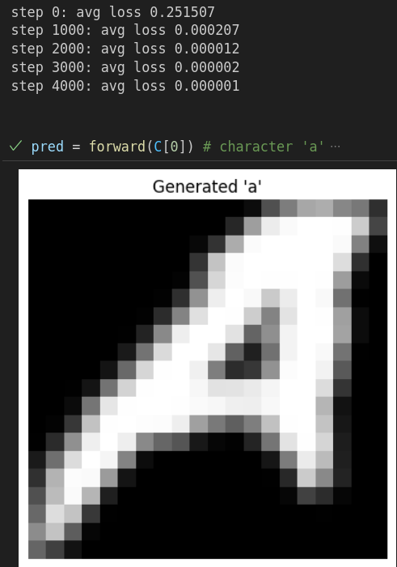
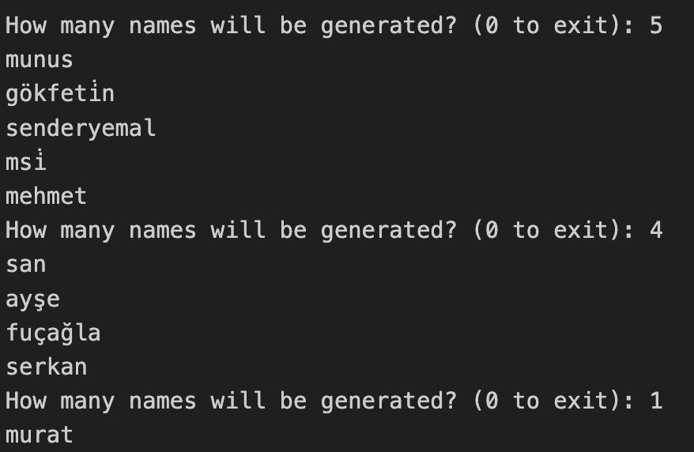

# Markov to Transformers: Character-Level Name Generation

This repo explores character-level name generation using different modeling techniques - from a straightforward trigram-based Markov Model to more expressive neural networks like MLPs and beyond.

Models include:
- **Trigram Markov**: a simple probabilistic baseline
- **Basic MLP**: neural next-character predictors
- **Positional Embedding MLP**: context-aware sequence learners
- **Char2Pix**: symbolic-to-visual letterform generators
- **BatchNorm-Folded MLP**: custom scratch-built networks optimized for inference

## Models

### 1. Trigram-based Markov Model

Generates new names using trigram probabilities from existing data, applying Laplace smoothing to handle unseen sequences.


- **Easy to understand** and quick to generate names.
- Good baseline for probabilistic models.

### 2. Multilayer Perceptron (MLP)

A simple neural network trained to predict the next character given two preceding characters.


- Tries to be fancier than Markov, but kinda just fumbles around. Super simple implementation (for now!)

### 3. Positional MLP Model

An improved version of the MLP model that incorporates both positional embeddings and dense character embeddings.

Each character is mapped to an n-dimensional embedding rather than a one-hot vector.

These embeddings are learned during training, allowing the model to capture relationships between characters.

Instead of zero-padding or treating all characters uniformly, the model assigns unique positional encodings to the start tokens.

This approach is inspired by [A Neural Probabilistic Language Model (Bengio et al., 2003)](https://www.jmlr.org/papers/volume3/bengio03a/bengio03a.pdf), with the additional inclusion of positional embeddings to enhance sequential awareness.


### 4. MLP Letterform Generator  -  *Char2Pix*
A scratch-built MLP that learns to **draw characters** from symbolic embeddings. Given a letter like `'h'`, the model outputs a 20x20 image representing its glyph. The network learns to decode letters into visual space using only supervision from pixel data.



- Font rendering is handled with PIL to create 20x20 grayscale glyphs.
- Each character is assigned a trainable embedding.
- A small MLP maps these embeddings to 400 pixels.
- The network is trained using MSE loss to match real font glyphs.

### 5. BatchNorm-Folded MLP (Turkish Name Generator)

A handcrafted MLP trained to generate Turkish names using character-level embeddings and BatchNorm-enhanced hidden layers.

What makes this model unique is its **post-training optimization**:  
after training, BatchNorm layers are **folded** into the preceding `Linear` layers by adjusting weights and biases directly - resulting in a faster, inference-only network without changing its predictions.

This technique was inspired by the FastAI post  
**[Faster Inference - Batch Normalization Folding](https://forums.fast.ai/t/faster-inference-batch-normalization-folding/69161)**.



- Fully custom PyTorch implementation (no `nn.Module` used)
- BatchNorm folding performed manually via algebraic transformation
- Generates names one character at a time using trigram context
- UTF-8 safe preprocessing for Turkish phonemes


## How to Run

### Markov Model
```bash
python models/markov-model.py
```

### Basic MLP Model
```bash
python models/MLP.py
```

### Positional MLP Model
```bash
python models/positional_MLP.py
```

Provide the path to your dataset (`names.txt`) when prompted. Models are interactive - enter a starting character and see generated names!

## Dependencies
- Python 3.x
- PyTorch

Install with:

```bash
pip install torch
```

## Dataset

Place your `names.txt` file inside the `data/` directory. Each line should contain one name.

## Notebooks
Check the notebooks for a detailed, step-by-step breakdown of each model, from preprocessing to training.

---
